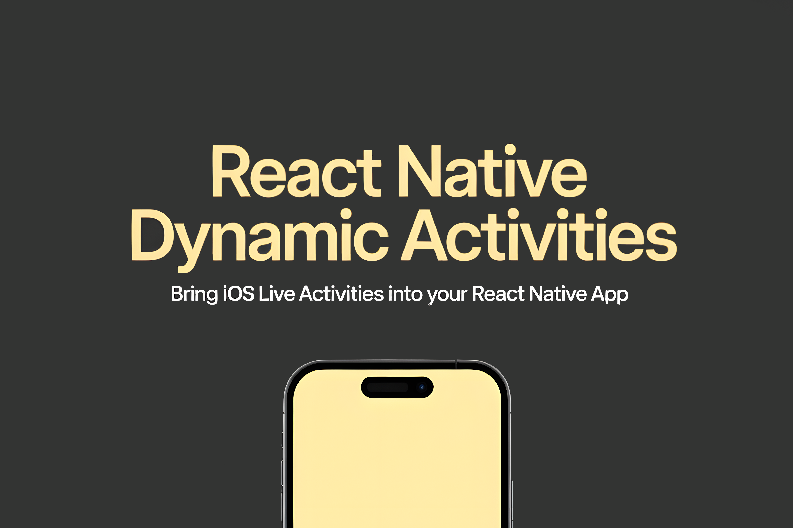

<p align="center">
  
</p>

<h1 align="center">react-native-dynamic-activities</h1>

<p align="center">
  A Nitro Modules powered React Native library to integrate iOS Live Activities with a type-safe, minimal API.
</p>

[](https://www.npmjs.com/package/react-native-dynamic-activities)
[](https://www.npmjs.com/package/react-native-dynamic-activities)
[](LICENSE)

## Overview

React Native Dynamic Activities gives you a simple, type-safe way to start, update, and end iOS Live Activities from JavaScript. It uses Nitro Modules for zero-bridge, JSI-backed performance and auto-generated Swift/TypeScript types.

> Demo video (coming soon)
>
> [Placeholder for short demo video/GIF showcasing starting, updating, and ending a Live Activity.]

## Production readiness

- iOS: Implemented using ActivityKit. Tested via unit tests and example app. Requires iOS 16.2+.
- Android: Not supported (APIs reject with a clear error).
- Status: Pre-1.0. Ready for `0.1.0` iOS-only release. API is small and type-safe; surface may evolve.

## Requirements

- React Native ≥ 0.76 (Nitro Views require RN ≥ 0.78, but this package does not require Nitro Views)
- Node ≥ 18
- iOS ≥ 16.2 (ActivityKit), Xcode 15+

## Installation

```bash
npm i react-native-dynamic-activities react-native-nitro-modules
# or
bun add react-native-dynamic-activities react-native-nitro-modules
```

Autolinking handles native integration. No manual linking required.

> Screenshot placeholder
>
> [Add a screenshot of the example widget running on device/lock screen here.]

## iOS setup

### 🚀 Quick Setup (Recommended)

Use the built-in widget scaffolder to generate everything automatically:

```bash
# Generate widget with defaults
npx react-native-dynamic-activities create-widget

# Custom configuration
npx react-native-dynamic-activities create-widget \
  --name=TimerWidget \
  --activity=TimerActivity \
  --bundle-id=com.yourapp.timer.widget
```

This creates complete Swift files, ActivityKit integration, and UI templates. Then just add the Widget Extension target in Xcode and replace the generated files.

### 📱 Expo Projects

For Expo managed workflow, add the config plugin:

```javascript
// app.config.js
export default {
	expo: {
		plugins: [
			[
				'react-native-dynamic-activities',
				{
					widgetName: 'MyAppWidget',
					activityName: 'MyActivity',
				},
			],
		],
	},
};
```

### 🛠 Manual Setup

Live Activities require a Widget Extension (WidgetKit + ActivityKit) and entitlements.

1. Add entitlements to your iOS app target:

- Enable "Live Activities" capability.

2. Create a Widget Extension in Xcode:

- File -> New -> Target… -> Widget Extension.
- Check "Include Live Activity" if available, or add an Activity configuration manually.
- Minimum iOS target: 16.2 or higher.

3. Define your Activity attributes and widget UI. Example:

```swift
// In your Widget Extension target
import ActivityKit
import SwiftUI

struct TimerAttributes: ActivityAttributes {
  public struct ContentState: Codable, Hashable {
    var state: String // "active", "ended", etc.
    var relevanceScore: Double?
  }
  var title: String
  var body: String
}

@main
struct TimerWidgetBundle: WidgetBundle {
  var body: some Widget {
    TimerLiveActivity()
  }
}

struct TimerLiveActivity: Widget {
  var body: some WidgetConfiguration {
    ActivityConfiguration(for: TimerAttributes.self) { context in
      // Lock Screen / Banner UI
      HStack {
        Text(context.attributes.title)
        Text(context.state.state)
      }
    } dynamicIsland: { context in
      DynamicIsland {
        DynamicIslandExpandedRegion(.leading) { Text(context.attributes.title) }
        DynamicIslandExpandedRegion(.trailing) { Text("\(context.state.relevanceScore ?? 0, specifier: "%.2f")") }
      } compactLeading: {
        Text("T")
      } compactTrailing: {
        Text("⏱")
      } minimal: {
        Text("T")
      }
    }
  }
}
```

Note: The JS-facing types (`LiveActivityAttributes`, `LiveActivityContent`) should semantically match your Swift `ActivityAttributes` and `ContentState` fields you use in the widget.

> Tip: Keep your Swift attributes and the TS interfaces aligned for predictable rendering in your Widget UI.

## Usage

```ts
import {
	DynamicActivities,
	type LiveActivityAttributes,
	type LiveActivityContent,
} from 'react-native-dynamic-activities';

// Check support and OS version
const info = await DynamicActivities.areLiveActivitiesSupported();
// { supported: boolean, version: number, comment: string }

// Start an activity
const attributes: LiveActivityAttributes = {
	title: 'Timer',
	body: 'Counting down',
};
const content: LiveActivityContent = { state: 'active', relevanceScore: 1 };
const { activityId, pushToken } = await DynamicActivities.startLiveActivity(
	attributes,
	content
);

// Update activity
await DynamicActivities.updateLiveActivity(activityId, {
	state: 'active',
	relevanceScore: 0.8,
});

// End activity
await DynamicActivities.endLiveActivity(
	activityId,
	{ state: 'ended' },
	'default'
);
```

### Error handling

Native errors are normalized with helpful messages and codes (matching ActivityAuthorizationError where applicable).

```ts
import {
	LiveActivityErrorFactory,
	isLiveActivityError,
	LiveActivityErrorCode,
} from 'react-native-dynamic-activities';

try {
	await DynamicActivities.startLiveActivity(attributes, content);
} catch (e) {
	const err = LiveActivityErrorFactory.createErrorFromNativeError(e);
	if (isLiveActivityError(err)) {
		if (err.code === LiveActivityErrorCode.DENIED) {
			// guide user to enable in Settings
		}
	}
}
```

## Example app

The repo includes an example app demonstrating a simple timer Live Activity.

```bash
# From repo root
npm i

# iOS (requires Ruby + Bundler)
cd example
npm i
bundle install
bundle exec pod install --project-directory=ios
npm run ios
```

Note: You must add a Widget Extension and enable the Live Activities entitlement in the example app (Xcode) for the system UI to appear on the Lock Screen/Dynamic Island.

For complete setup documentation, see [WIDGET_SETUP.md](WIDGET_SETUP.md).

## API

- `areLiveActivitiesSupported(): Promise<{ supported: boolean; version: number; comment: string }>`
- `startLiveActivity(attributes, content, pushToken?, style?, alertConfiguration?, start?): Promise<{ activityId: string; pushToken?: string }>`
- `updateLiveActivity(activityId, content, alertConfiguration?, timestamp?): Promise<void>`
- `endLiveActivity(activityId, content, dismissalPolicy?): Promise<void>`

Platform notes:

- iOS only. Android methods reject with an error.
- Some parameters are available only on newer iOS versions (e.g., `style` on 18.0+, timestamp support on 17.2+). See TS spec docs.

## Troubleshooting

- No widget shown: Ensure the app has a Widget Extension configured and Live Activities capability enabled.
- `denied` errors: User disabled Live Activities; guide them to Settings.
- Simulator support is limited. Test on a physical device for Dynamic Island/Lock Screen.
- If build errors mention Nitro types, run `npm run codegen` and clean Xcode build.

## Contributing

See [CONTRIBUTING.md](CONTRIBUTING.md) for development, testing, and PR guidelines.

## Credits

Bootstrapped with [create-nitro-module](https://github.com/patrickkabwe/create-nitro-module).

## License

MIT © Pieczasz
