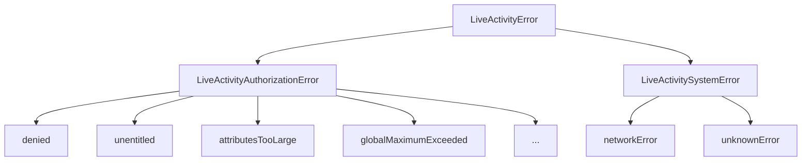

# Error Handling Overview

React Native Dynamic Activities provides a comprehensive, type-safe error handling system that maps exactly to Apple's ActivityKit errors while adding helpful recovery suggestions and structured error information.

## 🎯 Error Philosophy

### Fail Fast with Clear Messages
Every error provides:
- ✅ **Clear error message** explaining what went wrong
- ✅ **Actionable recovery suggestion** telling users how to fix it
- ✅ **Error severity level** to help prioritize issues
- ✅ **Structured error codes** for programmatic handling

### Type-Safe Error Handling
```typescript
import { 
  DynamicActivities,
  isLiveActivityError,
  isAuthorizationError,
  isSystemError,
  getErrorSeverity,
  LiveActivityErrorSeverity
} from 'react-native-dynamic-activities';

try {
  await DynamicActivities.startLiveActivity(attributes, content);
} catch (error) {
  if (isLiveActivityError(error)) {
    // TypeScript now knows this is a LiveActivityError
    console.log(error.code);              // Typed error code
    console.log(error.message);           // Human-readable message
    console.log(error.recoverySuggestion); // How to fix it
    console.log(getErrorSeverity(error)); // CRITICAL | HIGH | MEDIUM | LOW
  }
}
```

## 🏗️ Error Architecture

### Error Hierarchy



### Error Categories

| Category | Description | Examples | Recovery |
|----------|-------------|----------|----------|
| **Authorization Errors** | User permissions, system limits | `denied`, `unentitled`, `globalMaximumExceeded` | Enable in Settings, add entitlements |
| **System Errors** | Platform, network issues | `networkError`, `unknownError` | Retry, check connectivity |

## 📋 Error Structure

### LiveActivityError Interface
```typescript
interface LiveActivityError {
  code: LiveActivityErrorCode;           // Structured error code
  message: string;                       // Human-readable description
  failureReason?: string;                // Technical reason (from native layer)
  recoverySuggestion?: string;           // How to fix the issue
  nativeError?: unknown;                 // Original native error object
  activityId?: string;                   // Activity ID if applicable
  timestamp: Date;                       // When the error occurred
  errorCode?: number;                    // Native error code
  errorDomain?: string;                  // Native error domain
}
```

### Error Codes
All error codes exactly match Apple's ActivityKit error cases:

```typescript
enum LiveActivityErrorCode {
  // Authorization Errors (match Apple's ActivityAuthorizationError)
  ATTRIBUTES_TOO_LARGE = "attributesTooLarge",
  DENIED = "denied", 
  GLOBAL_MAXIMUM_EXCEEDED = "globalMaximumExceeded",
  MALFORMED_ACTIVITY_IDENTIFIER = "malformedActivityIdentifier",
  MISSING_PROCESS_IDENTIFIER = "missingProcessIdentifier",
  PERSISTENCE_FAILURE = "persistenceFailure",
  RECONNECT_NOT_PERMITTED = "reconnectNotPermitted",
  TARGET_MAXIMUM_EXCEEDED = "targetMaximumExceeded",
  UNENTITLED = "unentitled",
  UNSUPPORTED = "unsupported",
  UNSUPPORTED_TARGET = "unsupportedTarget",
  VISIBILITY = "visibility",

  // System Errors
  NETWORK_ERROR = "networkError",
  UNKNOWN_ERROR = "unknownError",
}
```

## 🔍 Error Type Guards

### Type Guard Functions
React Native Dynamic Activities provides type guard functions for safe error handling:

```typescript
// Check if error is from this library
if (isLiveActivityError(error)) {
  // error is now typed as LiveActivityError
  console.log('Library error:', error.code);
}

// Check specific error categories  
if (isAuthorizationError(error)) {
  // error is LiveActivityAuthorizationError
  handlePermissionError(error);
}

if (isSystemError(error)) {
  // error is LiveActivitySystemError  
  handleSystemError(error);
}
```

### Error Severity
```typescript
import { getErrorSeverity, LiveActivityErrorSeverity } from 'react-native-dynamic-activities';

const severity = getErrorSeverity(error);

switch (severity) {
  case LiveActivityErrorSeverity.CRITICAL:
    // App can't function - missing entitlements, unsupported platform
    showCriticalErrorDialog(error);
    break;
    
  case LiveActivityErrorSeverity.HIGH:  
    // Feature unavailable - user disabled, permissions issue
    showPermissionRequestDialog(error);
    break;
    
  case LiveActivityErrorSeverity.MEDIUM:
    // Temporary issue - rate limits, data too large
    showRetryDialog(error);
    break;
    
  case LiveActivityErrorSeverity.LOW:
    // Minor issue - network hiccup
    showToast(error.message);
    break;
}
```

## 🛠️ Error Factory

### Creating Errors
The `LiveActivityErrorFactory` helps create structured errors:

```typescript
import { LiveActivityErrorFactory, LiveActivityErrorCode } from 'react-native-dynamic-activities';

// Create authorization error
const authError = LiveActivityErrorFactory.createAuthorizationError(
  LiveActivityErrorCode.DENIED,
  "Live Activities are disabled",
  {
    failureReason: "User disabled in Settings",
    recoverySuggestion: "Enable Live Activities in Settings > YourApp",
    activityId: "activity-123"
  }
);

// Create system error
const systemError = LiveActivityErrorFactory.createSystemError(
  LiveActivityErrorCode.NETWORK_ERROR,
  "Failed to update Live Activity", 
  {
    failureReason: "Network request timed out",
    recoverySuggestion: "Check internet connection and try again"
  }
);

// Create error from native error object
const mappedError = LiveActivityErrorFactory.createErrorFromNativeError(
  nativeError,
  "activity-456"
);
```

## 📊 Error Messages & Recovery

### Built-in Messages
Every error code has a predefined, user-friendly message:

```typescript
import { LiveActivityErrorMessages, LiveActivityRecoverySuggestions } from 'react-native-dynamic-activities';

const errorMessage = LiveActivityErrorMessages[LiveActivityErrorCode.DENIED];
// "A person deactivated Live Activities in Settings."

const recoverySuggestion = LiveActivityRecoverySuggestions[LiveActivityErrorCode.DENIED];
// "Ask the user to enable Live Activities in Settings > [Your App] > Live Activities."
```

### Customizing Error Messages
```typescript
const customError = LiveActivityErrorFactory.createAuthorizationError(
  LiveActivityErrorCode.DENIED,
  "🚫 Live Activities are turned off", // Custom message
  {
    recoverySuggestion: "Tap Settings to enable Live Activities for pizza tracking! 🍕"
  }
);
```

## 🎯 Common Error Handling Patterns

### 1. Graceful Degradation
```typescript
const handleLiveActivityError = (error: LiveActivityError) => {
  switch (error.code) {
    case LiveActivityErrorCode.DENIED:
    case LiveActivityErrorCode.UNSUPPORTED:
      // Hide Live Activity features, continue with app
      setLiveActivitiesEnabled(false);
      showInAppNotifications(true);
      break;
      
    case LiveActivityErrorCode.GLOBAL_MAXIMUM_EXCEEDED:
    case LiveActivityErrorCode.TARGET_MAXIMUM_EXCEEDED:
      // Too many activities - queue for later
      queueActivityForLater(attributes, content);
      showMessage("Live Activity queued - will start when space available");
      break;
      
    case LiveActivityErrorCode.NETWORK_ERROR:
      // Retry with exponential backoff
      scheduleRetry(retryStartLiveActivity, Math.min(retryCount * 2, 30));
      break;
      
    default:
      // Unexpected error - log and show generic message
      logError(error);
      showMessage("Something went wrong. Please try again.");
  }
};
```

### 2. User-Friendly Error UI
```typescript
const LiveActivityErrorBoundary = ({ error, onRetry }: {
  error: LiveActivityError;
  onRetry: () => void;
}) => {
  const severity = getErrorSeverity(error);
  
  return (
    <View style={[styles.errorContainer, getErrorStyle(severity)]}>
      <Text style={styles.errorIcon}>
        {severity === LiveActivityErrorSeverity.CRITICAL ? '🚨' : '⚠️'}
      </Text>
      <Text style={styles.errorMessage}>{error.message}</Text>
      {error.recoverySuggestion && (
        <Text style={styles.recoverySuggestion}>{error.recoverySuggestion}</Text>
      )}
      
      {severity !== LiveActivityErrorSeverity.CRITICAL && (
        <Button title="Try Again" onPress={onRetry} />
      )}
      
      {error.code === LiveActivityErrorCode.DENIED && (
        <Button title="Open Settings" onPress={openAppSettings} />
      )}
    </View>
  );
};
```

### 3. Logging & Analytics
```typescript
const logLiveActivityError = (error: LiveActivityError, context?: string) => {
  // Structure error data for analytics
  const errorData = {
    code: error.code,
    message: error.message,
    severity: getErrorSeverity(error),
    activityId: error.activityId,
    context,
    timestamp: error.timestamp.toISOString(),
    platform: Platform.OS,
    errorDomain: error.errorDomain,
    nativeErrorCode: error.errorCode,
  };
  
  // Send to your analytics service
  Analytics.track('live_activity_error', errorData);
  
  // Log to console in development
  if (__DEV__) {
    console.group(`🚨 Live Activity Error: ${error.code}`);
    console.log('Message:', error.message);
    console.log('Recovery:', error.recoverySuggestion);
    console.log('Severity:', getErrorSeverity(error));
    console.log('Full error:', error);
    console.groupEnd();
  }
};
```

## 🔗 Detailed Error References

### Authorization Errors
Learn about permission and entitlement-related errors:
- **Authorization Errors Guide** - User permissions, app entitlements, system limits

### System Errors  
Learn about platform and network-related errors:
- **System Errors Guide** - Network issues, platform compatibility, unknown errors

### Error Factory
Learn about creating and managing errors programmatically:
- **Error Factory Reference** - Creating custom errors, mapping native errors

## 💡 Best Practices

### 1. Always Use Type Guards
```typescript
// ✅ Good: Type-safe error handling
try {
  await DynamicActivities.startLiveActivity(attrs, content);
} catch (error) {
  if (isLiveActivityError(error)) {
    handleLiveActivityError(error);
  } else {
    handleGenericError(error);
  }
}

// ❌ Bad: Assuming error type
try {
  await DynamicActivities.startLiveActivity(attrs, content);
} catch (error: any) {
  console.log(error.code); // May not exist!
}
```

### 2. Provide Actionable Recovery
```typescript
const showErrorWithAction = (error: LiveActivityError) => {
  Alert.alert(
    'Live Activity Error',
    `${error.message}\n\n${error.recoverySuggestion}`,
    [
      { text: 'Cancel', style: 'cancel' },
      { 
        text: error.code === 'denied' ? 'Open Settings' : 'Try Again',
        onPress: error.code === 'denied' ? openAppSettings : retryOperation
      }
    ]
  );
};
```

### 3. Log Errors for Debugging
```typescript
// Include context when logging errors
catch (error) {
  if (isLiveActivityError(error)) {
    logLiveActivityError(error, 'pizza_delivery_start');
  }
}
```

### 4. Handle Errors at the Right Level
```typescript
// Handle at component level for UI errors
const PizzaTracker = () => {
  const [error, setError] = useState<LiveActivityError | null>(null);
  
  if (error) {
    return <LiveActivityErrorBoundary error={error} onRetry={startTracking} />;
  }
  
  // ... component logic
};

// Handle at app level for critical errors
const App = () => {
  useEffect(() => {
    const checkSupport = async () => {
      try {
        const info = await DynamicActivities.areLiveActivitiesSupported();
        if (!info.supported) {
          // Disable Live Activity features globally
          setGlobalFeature('liveActivities', false);
        }
      } catch (error) {
        // Critical initialization error
        if (isLiveActivityError(error) && getErrorSeverity(error) === LiveActivityErrorSeverity.CRITICAL) {
          handleCriticalError(error);
        }
      }
    };
    
    checkSupport();
  }, []);
};
```

---

**Next:** Dive deep into specific error types and learn more about authorization patterns! ⚠️