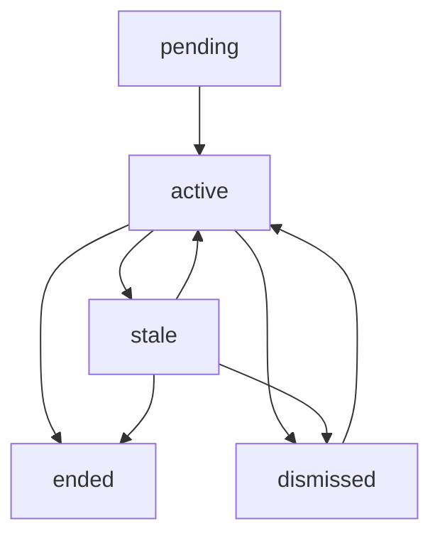

# LiveActivityState

The `LiveActivityState` represents the current state of a Live Activity. This determines how the activity is displayed to users and affects its priority in the Dynamic Island and Lock Screen.

## Type Definition

```typescript
export type LiveActivityState = "active" | "dismissed" | "pending" | "stale" | "ended";
```

## State Meanings

### `"active"`
The Live Activity is currently running and showing relevant, up-to-date information.

**Use Case:**
- Order is being prepared
- Workout in progress  
- Timer running
- Live sports score updates

**Visual Behavior:**
- ✅ Shows prominently in Dynamic Island
- ✅ Full visibility on Lock Screen
- ✅ High relevance score recommended (0.7-1.0)

```typescript
await DynamicActivities.startLiveActivity(
  { title: "Pizza Delivery", body: "Order #123" },
  { 
    state: "active", 
    relevanceScore: 1.0 
  }
);
```

### `"pending"` *(iOS 18.0+)*
The Live Activity is waiting for something to happen or is in a preparatory state.

**Use Case:**
- Waiting for driver assignment
- Order placed but not confirmed
- Timer set but not started
- Waiting for payment processing

**Visual Behavior:**
- 🟡 Lower prominence in Dynamic Island
- 🟡 Visible on Lock Screen with "pending" styling
- 🟡 Medium relevance score recommended (0.4-0.6)

```typescript
// iOS 18.0+ only
await DynamicActivities.startLiveActivity(
  { title: "Ride Request", body: "Finding a driver..." },
  { 
    state: "pending", 
    relevanceScore: 0.5 
  }
);
```

### `"stale"`
The Live Activity content is out of date and needs to be updated.

**Use Case:**
- Network connection lost
- Data hasn't updated for a while
- Server communication failed

**Visual Behavior:**
- 🔴 Reduced prominence in Dynamic Island
- 🔴 Shows with "stale" visual indicators
- 🔴 Low relevance score recommended (0.1-0.3)

```typescript
// Usually set automatically by the system, but can be set manually
await DynamicActivities.updateLiveActivity(
  activityId,
  { 
    state: "stale", 
    relevanceScore: 0.2 
  }
);
```

### `"dismissed"`
The Live Activity has been dismissed by the user or system but data might still be relevant.

**Use Case:**
- User swiped away the activity
- System dismissed due to time limits
- Activity temporarily hidden

**Visual Behavior:**
- 🚫 No longer visible in Dynamic Island
- 🚫 No longer visible on Lock Screen
- 🚫 Very low relevance (0.0-0.1)

**Note:** Usually set automatically by the system when user dismisses the activity.

### `"ended"`
The Live Activity has completed and should be permanently closed.

**Use Case:**
- Pizza delivered
- Workout completed
- Timer finished
- Final score posted

**Visual Behavior:**
- ✅ Shows completion state briefly
- 🚫 Then automatically removes from UI
- 🔴 Relevance score should be low (0.0-0.1)

```typescript
await DynamicActivities.endLiveActivity(
  activityId,
  { 
    state: "ended", 
    relevanceScore: 0.1 
  },
  'default' // Dismissal policy
);
```

## State Transitions

### Typical Flow


### Common Patterns

#### 1. Order Tracking Flow
```typescript
// Order placed
{ state: "pending", relevanceScore: 0.5 }

// Kitchen starts preparing  
{ state: "active", relevanceScore: 0.9 }

// Out for delivery
{ state: "active", relevanceScore: 1.0 }

// Delivered
{ state: "ended", relevanceScore: 0.1 }
```

#### 2. Timer Flow
```typescript
// Timer set but not started
{ state: "pending", relevanceScore: 0.3 }

// Timer running
{ state: "active", relevanceScore: 1.0 }

// Timer completed
{ state: "ended", relevanceScore: 0.1 }
```

#### 3. Error Recovery Flow
```typescript
// Normal operation
{ state: "active", relevanceScore: 0.8 }

// Connection lost
{ state: "stale", relevanceScore: 0.2 }

// Connection restored
{ state: "active", relevanceScore: 0.8 }
```

## Best Practices

### 1. Choose Appropriate Initial State
```typescript
// ✅ Good: Start with pending for uncertain states
await DynamicActivities.startLiveActivity(
  attributes,
  { state: "pending", relevanceScore: 0.4 }
);

// ❌ Avoid: Starting with active if not immediately active
await DynamicActivities.startLiveActivity(
  attributes,
  { state: "active", relevanceScore: 1.0 } // Only if immediately active
);
```

### 2. Update States Progressively
```typescript
const updateOrderState = async (activityId: string, orderStatus: string) => {
  switch (orderStatus) {
    case 'placed':
      await DynamicActivities.updateLiveActivity(activityId, {
        state: "pending",
        relevanceScore: 0.4
      });
      break;
      
    case 'preparing':
      await DynamicActivities.updateLiveActivity(activityId, {
        state: "active", 
        relevanceScore: 0.8
      });
      break;
      
    case 'out_for_delivery':
      await DynamicActivities.updateLiveActivity(activityId, {
        state: "active",
        relevanceScore: 1.0
      });
      break;
      
    case 'delivered':
      await DynamicActivities.endLiveActivity(activityId, {
        state: "ended",
        relevanceScore: 0.1
      });
      break;
  }
};
```

### 3. Handle Network Issues
```typescript
const updateWithFallback = async (activityId: string, newContent: LiveActivityContent) => {
  try {
    await DynamicActivities.updateLiveActivity(activityId, newContent);
  } catch (error) {
    // If update fails, mark as stale
    try {
      await DynamicActivities.updateLiveActivity(activityId, {
        ...newContent,
        state: "stale",
        relevanceScore: 0.2
      });
    } catch (staleError) {
      console.error('Failed to mark as stale:', staleError);
    }
  }
};
```

### 4. iOS Version Compatibility
```typescript
const createLiveActivityWithVersion = async (
  attributes: LiveActivityAttributes,
  content: LiveActivityContent
) => {
  const supportInfo = await DynamicActivities.areLiveActivitiesSupported();
  
  // Check if pending state is supported (iOS 18.0+)
  if (content.state === "pending" && supportInfo.version < 18.0) {
    // Fallback to active state for older iOS versions
    content = { ...content, state: "active" };
  }
  
  return await DynamicActivities.startLiveActivity(attributes, content);
};
```

## State-Specific Styling

### SwiftUI State Styling
In your widget's SwiftUI code, you can style based on state:

```swift
// In your LiveActivity SwiftUI view
VStack {
    HStack {
        Text(context.attributes.title)
            .font(.headline)
        Spacer()
        
        // State-based styling
        Text(context.state.state.capitalized)
            .font(.caption)
            .padding(.horizontal, 8)
            .padding(.vertical, 4)
            .background(stateColor(context.state.state))
            .cornerRadius(8)
            .foregroundColor(.white)
    }
}

// Helper function for state colors
private func stateColor(_ state: String) -> Color {
    switch state {
    case "active": return .green
    case "pending": return .orange
    case "stale": return .gray
    case "ended": return .blue
    case "dismissed": return .red
    default: return .gray
    }
}
```

## Error Handling

### Invalid State Transitions
```typescript
const validateStateTransition = (currentState: LiveActivityState, newState: LiveActivityState): boolean => {
  // Some state transitions don't make sense
  const invalidTransitions: Record<LiveActivityState, LiveActivityState[]> = {
    "ended": ["active", "pending", "stale"], // Can't go back from ended
    "dismissed": [], // Can transition from dismissed to any state
    "active": [], 
    "pending": [],
    "stale": []
  };
  
  return !invalidTransitions[currentState]?.includes(newState);
};

// Usage
if (!validateStateTransition(currentState, newState)) {
  console.warn(`Invalid state transition from ${currentState} to ${newState}`);
}
```

---

**Next:** Learn about LiveActivityContent to understand the complete content structure! 📄