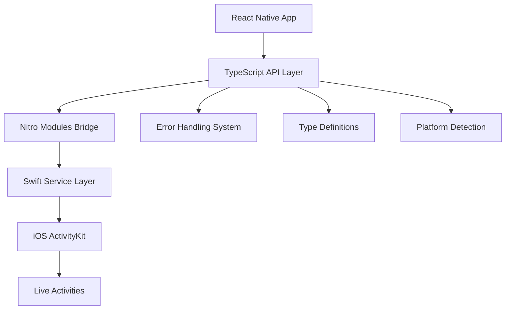

# API Reference Overview

Complete TypeScript API reference for React Native Dynamic Activities. All APIs are fully type-safe with comprehensive error handling and platform compatibility checks.

## 🏗️ Architecture Overview

React Native Dynamic Activities provides a clean, type-safe API layer that bridges JavaScript and native iOS ActivityKit through Nitro Modules:



## 📦 Core Exports

### Main Export
```typescript
import { DynamicActivities } from 'react-native-dynamic-activities';
```

The primary API object providing all Live Activity operations.

### Type Exports
```typescript
import type {
  // Core Data Types
  LiveActivityAttributes,
  LiveActivityContent, 
  LiveActivityState,
  LiveActivityStartResult,
  
  // Configuration Types
  LiveActivityPushToken,
  LiveActivityStyle,
  LiveActivityDismissalPolicy,
  LiveActivityAlertConfiguration,
  
  // Error Types
  LiveActivityError,
  LiveActivityAuthorizationError,
  LiveActivitySystemError,
  LiveActivityErrorCode,
  
  // Support Info
  LiveActivitiesSupportInfo,
  PushTokenUpdateEvent,
} from 'react-native-dynamic-activities';
```

### Utility Exports
```typescript
import {
  // Error Handling
  LiveActivityErrorFactory,
  LiveActivityErrorMessages,
  LiveActivityRecoverySuggestions,
  isLiveActivityError,
  isAuthorizationError,
  isSystemError,
  getErrorSeverity,
  
  // Constants
  LIVE_ACTIVITY_ERROR_DOMAIN,
} from 'react-native-dynamic-activities';
```

## 🎯 Quick API Overview

### Core Methods

| Method | Purpose | Platform |
|--------|---------|----------|
| [`areLiveActivitiesSupported()`](dynamic-activities#-areliveactivitiessupported) | Check device/OS support | iOS/Android |
| [`startLiveActivity()`](dynamic-activities#-startliveactivity) | Create new Live Activity | iOS only |
| [`updateLiveActivity()`](dynamic-activities#-updateliveactivity) | Update existing activity | iOS only |
| [`endLiveActivity()`](dynamic-activities#-endliveactivity) | End activity gracefully | iOS only |

### Platform Support Matrix

| iOS Version | Support Level | Features Available |
|-------------|--------------|-------------------|
| **iOS 26.0+** | 🟢 Full | All features: alertConfiguration in start(), push channels, scheduling |
| **iOS 18.0+** | 🟢 Good | Style parameter, pending state support |
| **iOS 17.2+** | 🟡 Good | Timestamps in updates/end |
| **iOS 16.2-17.1** | 🟡 Limited | Basic Live Activities, alertConfiguration in updates only |
| **iOS 16.1** | 🟠 Minimal | ActivityKit available, Live Activities disabled |
| **iOS &lt;16.1** | 🔴 None | Returns descriptive errors |
| **Android** | 🔴 None | Clean rejection with helpful messages |

### Error Categories

| Error Type | Description | Recovery |
|------------|-------------|----------|
| **Authorization Errors** | User/system permissions | Enable in Settings |
| **System Errors** | Network/platform issues | Retry or check connectivity |
| **Validation Errors** | Invalid parameters | Fix input data |

## 🚀 Basic Usage Pattern

### 1. Check Support
```typescript
const supportInfo = await DynamicActivities.areLiveActivitiesSupported();
if (!supportInfo.supported) {
  console.log('Live Activities not supported:', supportInfo.comment);
  return;
}
```

### 2. Start Activity
```typescript
try {
  const result = await DynamicActivities.startLiveActivity(
    { title: "Pizza Delivery", body: "Order #1234" },
    { state: "preparing", relevanceScore: 1.0 }
  );
  console.log('Activity started:', result.activityId);
} catch (error) {
  if (isLiveActivityError(error)) {
    console.error('Live Activity error:', error.message);
    console.log('Recovery suggestion:', error.recoverySuggestion);
  }
}
```

### 3. Update Activity
```typescript
await DynamicActivities.updateLiveActivity(
  result.activityId,
  { state: "out_for_delivery", relevanceScore: 0.8 }
);
```

### 4. End Activity
```typescript
await DynamicActivities.endLiveActivity(
  result.activityId,
  { state: "delivered" },
  'default' // dismissal policy
);
```

## 📖 Detailed API Sections

### 🔧 Core API
- **[DynamicActivities](dynamic-activities)** - Main API object with all methods
- **LiveActivityAttributes** - Activity metadata and title
- **LiveActivityContent** - Dynamic state and content
- **[LiveActivityState](live-activity-state)** - Activity lifecycle states

### ⚠️ Error Handling
- **[Error Overview](errors/overview)** - Error system architecture
- **Authorization Errors** - Permission-related issues
- **System Errors** - Platform and network errors
- **Error Factory** - Creating and managing errors

### 🎛️ Types & Configuration
- **PushToken** - Remote notification tokens
- **DismissalPolicy** - How activities are dismissed
- **Style Options** - Activity display styles
- **Alert Configuration** - Notification settings

### 🎯 Examples & Patterns
- **API Examples** - Real-world usage patterns and code examples

## 🧪 Type Safety Features

### Strict TypeScript
All APIs use strict TypeScript with:
- **Non-nullable types** where appropriate
- **Discriminated unions** for error handling
- **Exact type matching** for configuration objects
- **Generic constraints** for extensibility

### Runtime Validation
- **Parameter validation** at the native bridge layer
- **iOS version compatibility** checks
- **Bundle identifier validation**
- **Activity lifecycle state verification**

### Development Experience  
- **Rich IntelliSense** with JSDoc documentation
- **Compile-time error checking** for invalid configurations
- **Auto-completion** for all methods and properties
- **Type-guided refactoring** when updating APIs

## 🎨 Design Principles

### 1. **Fail Fast & Clear**
```typescript
// ❌ Bad: Silent failures
const result = await startActivity(badData); // Returns null

// ✅ Good: Immediate, clear errors  
try {
  const result = await DynamicActivities.startLiveActivity(badData);
} catch (error) {
  console.log(error.message); // "Title is required"
  console.log(error.recoverySuggestion); // "Provide a title string"
}
```

### 2. **Platform Awareness**
```typescript
// Automatic platform detection with helpful messages
const supportInfo = await DynamicActivities.areLiveActivitiesSupported();
// iOS 16.2+: { supported: true, version: 16.2, comment: "Full support" }
// Android: { supported: false, version: 0, comment: "Live Activities are iOS-only" }
```

### 3. **Progressive Enhancement**
```typescript
// APIs gracefully handle different iOS versions
if (supportInfo.version >= 18.0) {
  // iOS 18.0+ - Use all features including pending state, style, alertConfiguration in start, push channels
  await DynamicActivities.startLiveActivity(
    attributes, 
    { ...content, state: 'pending' }, // pending state available
    { token: pushToken, channelId: 'channel-123' }, // push channels
    'transient', // style parameter
    alertConfig, // alertConfiguration in start
    new Date(Date.now() + 30000) // scheduled start
  );
} else if (supportInfo.version >= 17.2) {
  // iOS 17.2+ - Use timestamp in updates, no alertConfiguration in start
  await DynamicActivities.startLiveActivity(attributes, content, pushToken);
  await DynamicActivities.updateLiveActivity(id, content, alertConfig, new Date());
} else {
  // iOS 16.2+ - Basic features only
  await DynamicActivities.startLiveActivity(attributes, content, pushToken);
  await DynamicActivities.updateLiveActivity(id, content, alertConfig);
}
```

## 🔗 Related Resources

### Apple Documentation
- [ActivityKit Framework](https://developer.apple.com/documentation/activitykit)
- [Live Activities Design Guidelines](https://developer.apple.com/design/human-interface-guidelines/live-activities)
- [WidgetKit Programming Guide](https://developer.apple.com/documentation/widgetkit)

### React Native Resources
- [React Native Nitro Modules](https://github.com/margelo/react-native-nitro-modules)
- [Platform-specific Code](https://reactnative.dev/docs/platform-specific-code)

### Community Resources
- [GitHub Repository](https://github.com/pieczasz/react-native-dynamic-activities)
- [Example Projects](https://github.com/pieczasz/react-native-dynamic-activities/tree/main/example)
- [Stack Overflow Tag](https://stackoverflow.com/questions/tagged/react-native-dynamic-activities)

---

**Ready to dive deeper?** Start with the [DynamicActivities API Reference](dynamic-activities) to learn all available methods! 🚀