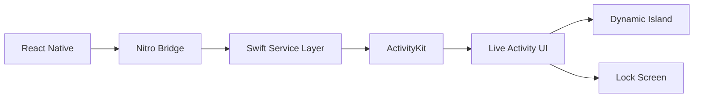

# Introduction

React Native Dynamic Activities brings the power of iOS Live Activities to React Native applications using cutting-edge **Nitro Modules** architecture. Create beautiful, interactive widgets that appear in the Dynamic Island and Lock Screen with type-safe, high-performance native integration.

## ✨ What are Live Activities?

Live Activities are a special type of interactive notification introduced in iOS 16.1 that display real-time information directly in:

- **Dynamic Island** (iPhone 14 Pro and later)
- **Lock Screen** notifications area
- **StandBy mode** (iOS 17+)

Perfect for tracking deliveries, sports scores, ride-sharing, timers, and any real-time data your users care about.

## 🎯 Why Choose React Native Dynamic Activities?

### 🚀 **Built with Nitro Modules**
- **Type-safe native bridge** with zero runtime overhead
- **Generated TypeScript definitions** from native Swift interfaces  
- **JSI-based communication** for lightning-fast performance
- **Memory efficient** with proper lifecycle management

### 🛡️ **Production Ready**
- **Comprehensive error handling** mapping Apple's ActivityKit errors exactly
- **iOS version compatibility** checks (16.2+ with graceful degradation)
- **Thread-safe operations** with proper async handling
- **Extensive test coverage** with real-world scenarios

### 🎨 **Developer Experience**
- **CLI widget generator** creates complete SwiftUI Live Activity templates
- **Hot reloading support** during development
- **Rich TypeScript intellisense** with JSDoc documentation
- **Clear error messages** with actionable recovery suggestions

### 🏗️ **Architecture Excellence**
- **Clean separation of concerns** between JS and native layers
- **Service layer pattern** in Swift for maintainable code
- **Generic ActivityAttributes** supporting most use cases out of the box
- **Android stub implementation** with descriptive error messages

## 🔧 How It Works



1. **React Native** calls type-safe APIs
2. **Nitro Bridge** handles JS ↔ Swift conversion
3. **Swift Service Layer** manages ActivityKit operations
4. **ActivityKit** creates system Live Activities
5. **SwiftUI Templates** render beautiful native UI

## 📱 Platform Support

| Platform | Support Level | Notes |
|----------|--------------|--------|
| **iOS 16.2+** | ✅ Full Support | Complete Live Activities functionality |
| **iOS 16.1** | ⚠️ Limited | ActivityKit available, Live Activities disabled |
| **iOS < 16.1** | ❌ Not Supported | Returns descriptive error messages |
| **Android** | 🚫 No Support | Clean rejection with helpful error messages |

## 🚀 Quick Example

```typescript
import { DynamicActivities } from 'react-native-dynamic-activities';

// Start a Live Activity
const result = await DynamicActivities.startLiveActivity(
  {
    title: "Pizza Delivery", 
    body: "Your pizza is being prepared"
  },
  {
    state: "preparing",
    relevanceScore: 1.0
  }
);

// Update with real-time data
await DynamicActivities.updateLiveActivity(
  result.activityId,
  {
    state: "out_for_delivery",
    relevanceScore: 0.8
  }
);

// End when complete
await DynamicActivities.endLiveActivity(
  result.activityId,
  { state: "delivered" }
);
```

## 🎯 What You'll Build

With React Native Dynamic Activities, you can create:

- 🍕 **Food delivery tracking** with real-time status updates
- 🚗 **Ride-sharing apps** showing driver location and ETA  
- ⏱️ **Workout timers** with live progress in Dynamic Island
- 📊 **Stock price monitors** with real-time market data
- 🎵 **Music players** with playback controls
- 🏈 **Sports scores** with live game updates

## 🎉 Ready to Get Started?

1. **[Installation Guide](installation)** - Set up the library in minutes
2. **[Getting Started](getting-started)** - Your first Live Activity
3. **[Widget Generation](widgets/overview)** - Create beautiful SwiftUI templates
4. **[API Reference](api/overview)** - Complete type-safe API documentation

---

**Next:** Learn how to [install and set up](installation) React Native Dynamic Activities in your project.